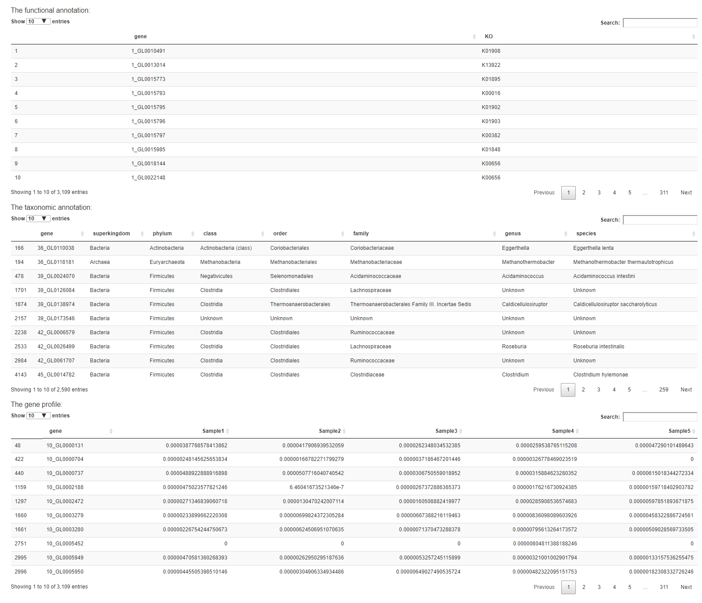

# metaFunc

An R package for comprehensive visualization of functional annotations by combining taxonomy

### Introduction
&emsp;&emsp;metaFunc is mainly used to display and interpret the functional annotation of metagenomic data. It will sort out the taxonomic profiling of all functional genes to get the community structure. Then, for each function, the corresponding genes will be grouped according to the taxonomic classification. Finally, the community structure and functions will be combined and showed in a complex combination block chart. The combination of them provides a full view that helps researchers gain actionable insights. metaFunc provides two usage modes: visual interface and function call. The high interactivity allows a quick examination of complex data. The user-friendly interface will enable users to manipulate the data and customize plot charts.

&emsp;&emsp;The GIF below shows the graphical interface of metaFunc:
<center>
<figure>

</center>
</figure>


### Installation

```
# Check or install packages
packages <- c("DT", "ggplot2", "ggrepel", "networkD3", "shiny", "tools")
lapply(packages, function(x) {
	if(!require(x, character.only = TRUE)) {
		install.packages(x, dependencies = TRUE)
	}})

# Install metaFunc and build vignettes
if (!requireNamespace("devtools", quietly = TRUE))
  install.packages("devtools")
library(devtools)
install_github("xiaonui/metaFunc", build_vignettes = TRUE)

```

### Quick Start

```

# Load the library
library(metaFunc)

# Run browser
blockShiny()

# You can also call the function directly
data(simple_demo)
blockPlot(func_data = simple_demo$func, tax_data = simple_demo$tax)

```

### Input data format

&emsp;&emsp;Before starting, you need to prepare two files: `functional annotation` and `taxonomic profiling`. Example files for these two datasets can be found in https://github.com/xiaonui/metaFunc/tree/master/extdata. 

&emsp;&emsp;The `functional annotation` should contain just two columns, the first column is the gene name, and the second column is the functional annotation. There should be no duplication of genes. If a gene corresponds to multiple functions, use the separator to connect. The structure of the data is shown below:

|gene|KO|
|---|---|
|1_GL0070533|K01734|
|1_GL0080019|K01961|
|1_GL0081307|K00382|
|1_GL0089373|K01962;K01963|
|1_GL0089857|K01734|
|...|...|


&emsp;&emsp;The `taxonomic profiling` needs to contain at least three columns, the first column is the gene, and the rest are the taxonomic classification. There should be no duplication of genes. Unknown taxonomic classification label `Unknown`. If a gene in a certain taxonomic rank is `Unknown`, the lower taxonomic rank should be `Unkown` too. The structure of the data is shown below:

|gene|superkingdom|phylum|class|order|family|genus|species|
|---|---|---|---|---|---|---|---|
|39_GL0024070|Bacteria|Firmicutes|Negativicutes|Selenomonadales|Acidaminococcaceae|Acidaminococcus|Acidaminococcus intestini|
|39_GL0126084|Bacteria|Firmicutes|Clostridia|Clostridiales|Lachnospiraceae|Unknown|Unknown|
|39_GL0173546|Bacteria|Unknown|Unknown|Unknown|Unknown| Unknown|
|...|...|...|...|...|...|...|...|

### Run browser
&emsp;&emsp;The user interface contains three tabs.

#### Upload Data
&emsp;&emsp;To begin the analysis, you need to upload your`functional annotation` file and `taxonomic profiling` file (comma-separated (.csv) or tab-separated (.txt) format). If you do not have datasets, you can use the demo data file by clicking on the "Load Demo (Xiao L et al.)" button. The demo is a part of the entire data for demonstration. It contains genes related to propionate metabolism in the non-redundant gene catalog. After the data is uploaded and checked, it will be displayed on the right, and the result tabs will appear in the top menu.

<center>
<figure>

</center>
</figure>

#### Overview
&emsp;&emsp;At first, you will be greeted with a data summary section: a bar plot showing the functions and the number of corresponding genes. 

<center>
<figure>

</center>
</figure>

If you double click in a brush on the plot, the chart will be zoomed to the brush bounds. And double-clicking again (outside brush) will reset the zoom.

<center>
<figure>


</center>
</figure>


&emsp;&emsp;The data will be shown in the table below. You need to select the functions of interest. The selected data will be displayed on the right. 

<center>
<figure>


</center>
</figure>


#### Combination Block Chart
&emsp;&emsp;For the functions selected in the table, the corresponding genes' data and their taxonomic classification will be extracted. The page will load with a complex combination block chart. You can change the "Tax Split Percentage" to adjust the taxonomic block.

<center>
<figure>

</center>
</figure>

 Besides using brush and double-click to zoom, you can also click the center part of the function block in the figure, and the detailed information will be displayed below. The more taxonomic classification will be shown in a sankey plot.
 
<center>
<figure>


</center>
</figure>


## Reference
 Xiao L, Sonne SB, Feng Q, et al. High-fat feeding rather than obesity drives taxonomical and functional changes in the gut microbiota in mice. Microbiome. 2017;5(1):43.


