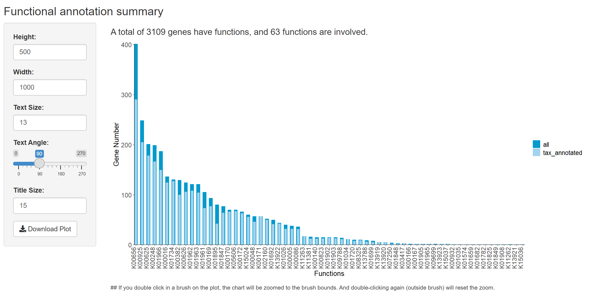

# metaFunc


&emsp;&emsp;MetaFunc is an R package for comprehensive visualization of functional annotations of microbiomes by combining their taxonomy information.

## 1. Introduction
&emsp;&emsp;metaFunc is mainly applied to display and interpret the functional annotation of metagenomic data. It will sort out the taxonomic profiling of all functional genes in a microbiome to get the community structure. Then, for each function, the corresponding genes will be grouped according to the taxonomic classification. Next, the number of genes in different samples will be calculated. Finally, the community structure and functions will be combined and showed in a complex combination block chart. The combination of them provides a full view that helps researchers gain actionable insights. metaFunc provides two usage modes: graphic interface and function call. The user-friendly graphic interface enables users to manipulate the data and customize plot charts.

## 2. Installing R/RStudio
&emsp;&emsp;metaFunc is a package in the R software environment, which can be freely downloaded as follows:

* Install [R](https://www.r-project.org/)
* Install [RStudio](https://www.rstudio.com/)

## 3. Installation

&emsp;&emsp;Check or install required packages.
```
packages <- c("DT", "ggplot2", "ggrepel", "networkD3", "shiny")
lapply(packages, function(x) {
	if(!require(x, character.only = TRUE)) {
		install.packages(x, dependencies = TRUE)
	}})

```

&emsp;&emsp;Install metaFunc from github.
```
if (!requireNamespace("devtools", quietly = TRUE))
  install.packages("devtools")
library(devtools)
install_github("xiaonui/metaFunc", build_vignettes = TRUE)
```

## 4 Quick Start

&emsp;&emsp;Load the library
```
library(metaFunc)
```

&emsp;&emsp;Run MetaFunc using a graphic interface.
```
blockShiny()
```

&emsp;&emsp;You can also call the visualization function blockPlot() directly. 
```
data(simple_demo)
blockPlot(func_data = simple_demo$func, tax_data = simple_demo$tax, gene_data = simple_demo$gene)

```

## 5 Input data format

&emsp;&emsp;Before starting, you need to prepare three files for `functional annotation`, `taxonomic classification` and `gene profile`. 

&emsp;&emsp;The file for `functional annotation` should contain just two columns. The first column is the gene name, and the second column is the functional annotation. There should be no duplication of gene identities. If a gene corresponds to multiple functions, use a separator to connect them. The separator can be a semicolon, comma or slash. By default, it is a semicolon. The structure of the data is shown below. 

|gene|KO|
|---|---|
|1_GL0070533|K01734|
|1_GL0080019|K01961|
|1_GL0081307|K00382|
|1_GL0089373|K01962;K01963|
|1_GL0089857|K01734|
|...|...|

&emsp;&emsp;The file for `taxonomic classification` should contain at least three columns. The first column is for the gene names, and the rest columns are for the taxonomic classification. There should be no duplicated gene names. Unknown taxonomic classification is labeled as `Unknown`. If a gene in a certain taxonomic rank is labeled as `Unknown`, the lower taxonomic rank(s) should be `Unknown` too. The structure of the data is shown below.

|gene|superkingdom|phylum|class|order|family|genus|species|
|---|---|---|---|---|---|---|---|
|39_GL0024070|Bacteria|Firmicutes|Negativicutes|Selenomonadales|Acidaminococcaceae|Acidaminococcus|Acidaminococcus intestini|
|39_GL0126084|Bacteria|Firmicutes|Clostridia|Clostridiales|Lachnospiraceae|Unknown|Unknown|
|39_GL0173546|Bacteria|Unknown|Unknown|Unknown|Unknown| Unknown|
|...|...|...|...|...|...|...|...|

&emsp;&emsp;The file for `gene profile` should contain at least two columns, the first column is for the gene names, and the rest columns are gene abundances in different genomes, which is also called gene profile. There should be no duplicated gene names. `0` represents gene absence, and positive numbers mean the genes presented. The structure of the data is shown as below.

|gene|Sample1|Sample2|Sample3|Sample4|Sample5|
|---|---|---|---|---|---|
|10_GL0000131 |3.877686e-05 |4.179069e-05 |2.623480e-05 |2.595388e-05 |4.729010e-05|
|10_GL0000704 |2.481456e-06 |1.667823e-06 |3.718647e-06 |3.267785e-06 |0.000000e+00|
|10_GL0000737 |4.889229e-05 |5.077160e-05 |3.067506e-05 |3.158846e-05 |6.150183e-05|
|10_GL0002188 |4.750236e-06 |6.460417e-07 |2.673729e-06 |1.762167e-06 |1.597184e-06|
|10_GL0002472 |2.713468e-06 |1.304702e-05 |1.605089e-05 |2.859085e-05 |5.978519e-06|
|10_GL0003279 |2.338997e-06 |6.998244e-06 |6.673882e-06 |8.360981e-06 |4.583229e-06|
|...|...|...|...|...|...|


## 6. Run graphic visualization interface
&emsp;&emsp;The user-friendly interface contains three tabs: "Upload Data", "Overview", and "Combination Block Chart", which will be introduced in more details as follows.

### 6.1 Upload Data
&emsp;&emsp;To begin the analysis, you need to upload three files for `functional annotation`, `taxonomic classification` and `gene_profile` (in comma-separated (.csv) or tab-separated (.txt) format). 

<center>
<figure>


Fig 1. Graphic user interface for input data uploading
</center>
</figure>
&nbsp; 

&emsp;&emsp;If you do not have these three files ready, you can use the demo data files by clicking the "Load Demo (Xiao L et al.)" button. The demo dataset contains genes in the non-redundant gene catalogs related to propionate metabolism. After the data files are uploaded and checked, they will be displayed, and the result tabs will automatically appear.

<center>
<figure>


Fig 2. Successfully uploaded data files
</center>
</figure>
&nbsp; 

### 6.2 Data Visualization overview
&emsp;&emsp;At first, you will be greeted with a data summary section: a bar plot showing the functions and the number of corresponding genes. For each function, the total number and the number of genes with their taxa annotated are shown. The pdf format of this figure can be generated and downloaded by clicking "Download Plot".

<center>
<figure>


Fig 3. Data summary section
</center>
</figure>
&nbsp; 

&emsp;&emsp;If you select an area and double click that area on the plot, the chart will be zoomed to the selected area. If no area is selected again, double-click anywhere outside the area to reset the zoom.

<center>
<figure>


Fig 4. Zoom the plot
</center>
</figure>
&nbsp; 


&emsp;&emsp;If you selected an area in the bar plot, the corresponding data will be shown in the table below the bar plot. Functions of interest can be further selected and displayed on the right.  

<center>
<figure>


Fig 5. Data selection
</center>
</figure>
&nbsp; 


### 6.3 Combination Block Chart
&emsp;&emsp;For the selected functions listed in the table, the corresponding genes' data and their taxonomic classification will be extracted. A page will be loaded with a complex combination block chart. You can change the "Taxon Split Percentage" to adjust the taxonomic block. The pdf format file of this figure can be generated and downloaded by clicking "Download Plot". 

<center>
<figure>


Fig 6. The results of the same data under different parameters (tax split percentage). The split percentage was 10% for the upper panel and 60% for the lower panel.
</center>
</figure>
&nbsp; 


&emsp;&emsp;You can hide the lollipop chart by adjusting the transparency (Fig 7).

<center>
<figure>


Fig 7. Combination block chart
</center>
</figure>
&nbsp; 

&emsp;&emsp;Besides selecting an area and double-click to zoom, you can also click a point in the taxon-function block (Fig 8).
 
<center>
<figure>


Fig 8. Click the point
</center>
</figure>
&nbsp; 

&emsp;&emsp;After clicking, the detailed information of genes corresponding to the point in the taxon-function block will be displayed as below (Fig 9). 

<center>
<figure>


Fig 9. The detailed information of genes (pointed by the red arrow in Fig 8)
</center>
</figure>
&nbsp; 

&emsp;&emsp;The detailed taxonomic annotations of all the corresponding genes can be viewed in a table (Fig 10).

<center>
<figure>


Fig 10. The data of genes
</center>
</figure>
&nbsp; 

&emsp;&emsp;More detailed taxonomic classification can also be shown in a Sankey plot (Fig 11).

<center>
<figure>


Fig 11. A Sankey plot
</center>
</figure>
&nbsp; 

## Reference:
 Xiao L, Sonne SB, Feng Q, et al. High-fat feeding rather than obesity drives taxonomical and functional changes in the gut microbiota in mice. Microbiome. 2017;5(1):43.

