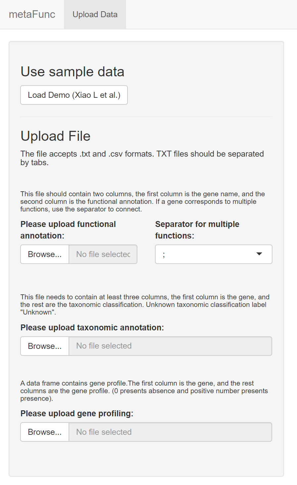
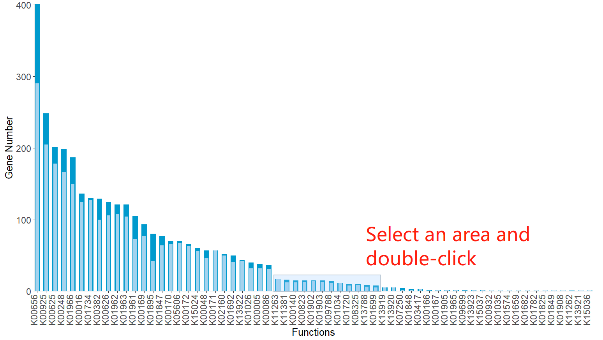
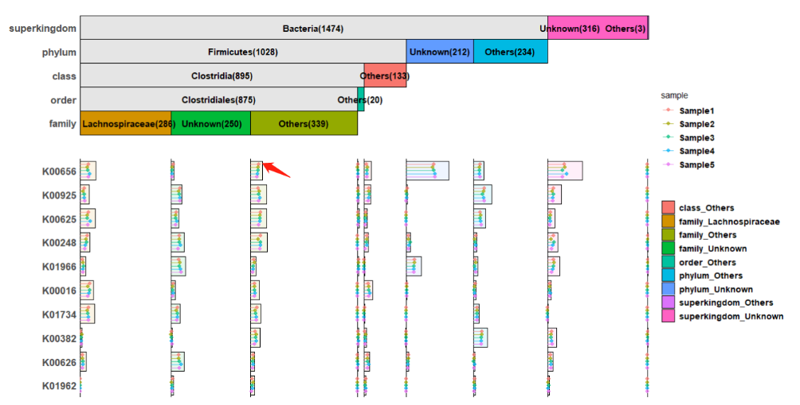
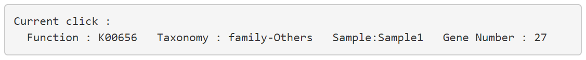

```{r, include = FALSE}
knitr::opts_chunk$set(
  collapse = TRUE,
  comment = "#>"
)
```

**2021-03**

&emsp;&emsp;An R package for comprehensive visualization of functional annotations of microbiomes by combining their taxonomy information

## 1. Introduction
&emsp;&emsp;metaFunc is mainly used to display and interpret the functional annotation of metagenomic data. It will sort out the taxonomic profiling of all functional genes in the microbiome to get the community structure. Then, for each function, the corresponding genes will be grouped according to the taxonomic classification. Next, calculate the number of genes in different samples. Finally, the community structure and functions will be combined and showed in a complex combination block chart. The combination of them provides a full view that helps researchers gain actionable insights. metaFunc provides two usage modes: visual interface and function call. The user-friendly interface will enable users to manipulate the data and customize plot charts.

## 2. Installing R/RStudio
&emsp;&emsp;If you do not already have R/RStudio installed, please do as follows:

* Install [R](https://www.r-project.org/)
* Install [RStudio](https://www.rstudio.com/)

## 3. Installation

&emsp;&emsp;Check or install packages
```{r eval=FALSE}
packages <- c("DT", "ggplot2", "ggrepel", "networkD3", "shiny", "tools")
lapply(packages, function(x) {
	if(!require(x, character.only = TRUE)) {
		install.packages(x, dependencies = TRUE)
	}})

```

&emsp;&emsp;Install metaFunc from github.
```{r eval=FALSE}
if (!requireNamespace("devtools", quietly = TRUE))
  install.packages("devtools")
library(devtools)
install_github("xiaonui/metaFunc", build_vignettes = TRUE)
```

## 4 Quick Start

&emsp;&emsp;Load the library
```{r eval = FALSE}
library(metaFunc)
```

&emsp;&emsp;Run browser
```{r eval = FALSE}
blockShiny()
```

&emsp;&emsp;You can also call the function directly
```{r eval = FALSE}
data(simple_demo)
blockPlot(func_data = simple_demo$func, tax_data = simple_demo$tax, gene_data = simple_demo$gene)

```

## 5 Input data format

&emsp;&emsp;Before starting, you need to prepare three files: `functional annotation`, `taxonomic classification` and `gene profile`. 
&emsp;&emsp;The `functional annotation` should contain just two columns, the first column is the gene name, and the second column is the functional annotation. There should be no duplication of genes. If a gene corresponds to multiple functions, use the separator to connect. The structure of the data is shown below:
```{r}
library(metaFunc)
data(simple_demo)
simple_demo$func[21:30,]
```

&emsp;&emsp;The `taxonomic classification` needs to contain at least three columns, the first column is the gene, and the rest are the taxonomic classification. There should be no duplication of genes. Unknown taxonomic classification label `Unknown`. If a gene in a certain taxonomic rank is `Unknown`, the lower taxonomic rank should be `Unkown` too. The structure of the data is shown below:
```{r}
head(simple_demo$tax)
```

&emsp;&emsp;The `gene profile` should contain at least two columns, the first column is the gene name, and the rest are gene profile. There should be no duplication of genes. `0` will be considered to be absence, and positive numbers means the gene is be present. The structure of the data is shown below:
```{r}
simple_demo$gene[30:40,]
```


## 6. Run browser
&emsp;&emsp;The user interface contains three tabs:"Upload Data", "Overview", and "Combination Block Chart".

### 6.1 Upload Data
&emsp;&emsp;To begin the analysis, you need to upload `functional annotation`, `taxonomic classification` and `gene_profile` (comma-separated (.csv) or tab-separated (.txt) format). 

<center>
<figure>


Fig 1. Interface for uploading data
</center>
</figure>

If you do not have datasets, you can use the demo data file by clicking on the "Load Demo (Xiao L et al.)" button. The demo is a part of the entire data for demonstration. It contains genes related to propionate metabolism in the non-redundant gene catalog. After the data is uploaded and checked, it will be displayed on the right, and the result tabs will automatically appear.

<center>
<figure>


Fig 2. Successfully uploaded data
</center>
</figure>

### 6.2 Overview
&emsp;&emsp;At first, you will be greeted with a data summary section: a bar plot showing the functions and the number of corresponding genes. You can download the picture (.pdf) by clicking "Download Plot".

<center>
<figure>


Fig 3. Data summary section
</center>
</figure>

If you double click in a brush on the plot, the chart will be zoomed to the brush bounds. And double-clicking again (outside brush) will reset the zoom.

<center>
<figure>



Fig 4. Zoom the plot
</center>
</figure>


&emsp;&emsp;The data will be shown in the table below. You need to select the functions of interest. The selected data will be displayed on the right. 

<center>
<figure>


Fig 5. Data selection
</center>
</figure>


### 6.3 Combination Block Chart
&emsp;&emsp;For the functions selected in the table, the corresponding genes' data and their taxonomic classification will be extracted. The page will load with a complex combination block chart. You can download the picture (.pdf) by clicking "Download Plot". 

<center>
<figure>


Fig 6. Combination block chart
</center>
</figure>

You can change the "Tax Split Percentage" to adjust the taxonomic block.

<center>
<figure>


Fig 7. Combination block chart
</center>
</figure>

&emsp;&emsp;Besides using brush and double-click to zoom, you can also click the point in the figure
 
<center>
<figure>


Fig 8. Click the point
</center>
</figure>

&emsp;&emsp;The detailed information will be displayed below. 

<center>
<figure>


Fig 9. The detailed information of point
</center>
</figure>

&emsp;&emsp;The detailed taxonomic annotations of all the corresponding genes can be viewed in the table.

<center>
<figure>


Fig 10. The data of genes
</center>
</figure>

&emsp;&emsp;The more taxonomic classification will be shown in a sankey plot.

<center>
<figure>


Fig 11. A sankey plot
</center>
</figure>

## Reference:
 Xiao L, Sonne SB, Feng Q, et al. High-fat feeding rather than obesity drives taxonomical and functional changes in the gut microbiota in mice. Microbiome. 2017;5(1):43.


